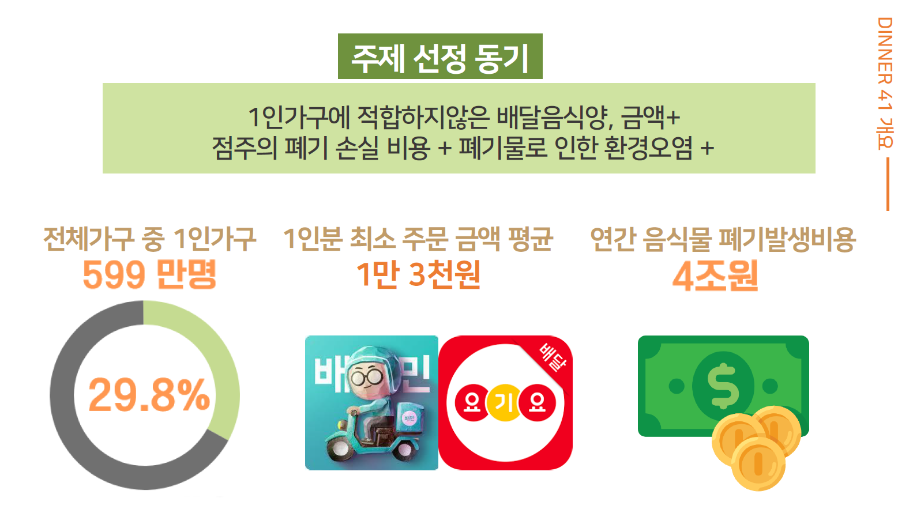
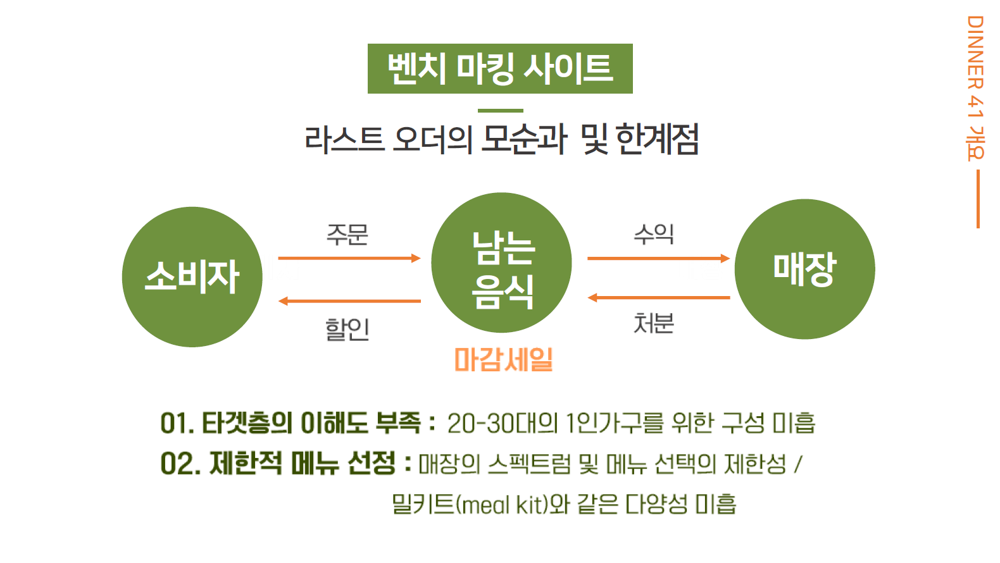
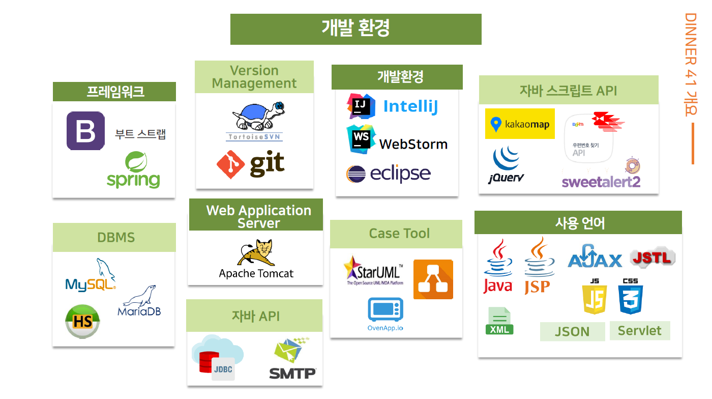
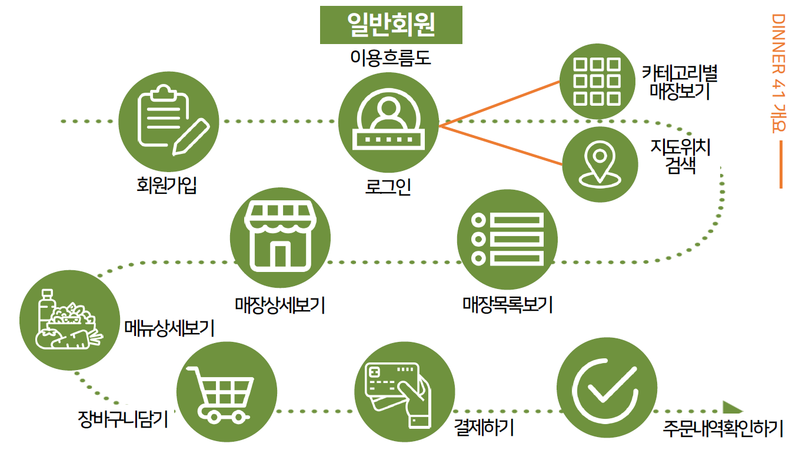
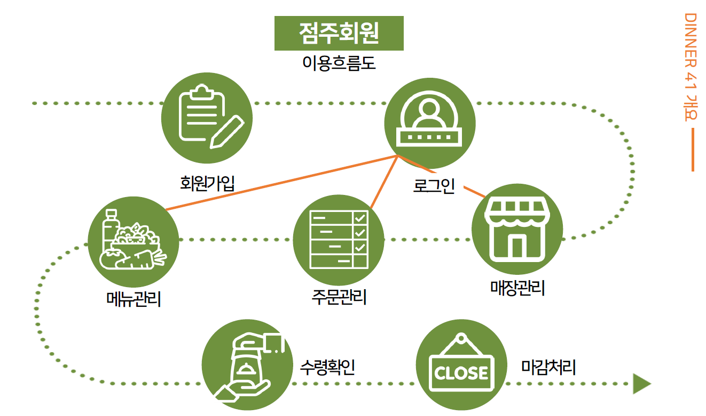
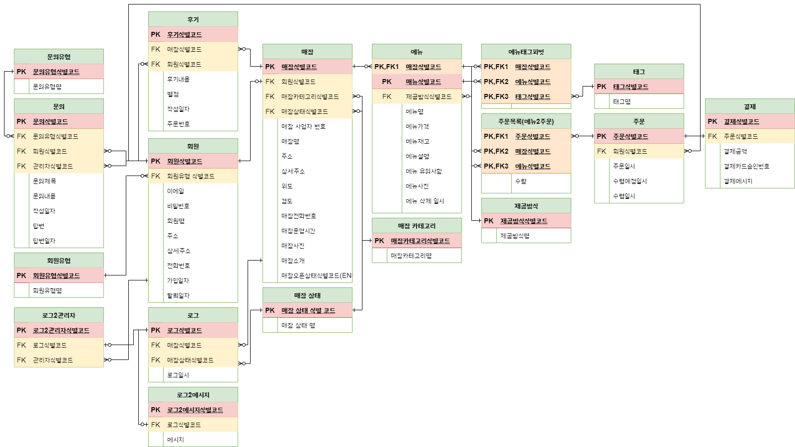

# 1인의 만찬
#### 1인가구를 위한 마감음식 패키징 서비스

1인의 만찬은 자영업자와 1인 가우 소비자들을 위한 마감 음식 패키징 서비스입니다.

---

## 개발 팀 정보
- 팀명 : Dinner41
- 팀장 : 김주성([@KINGJUSUNG](https://github.com/KINGJUSUNG))
- 부팀장 : 송무송([@moosongsong](https://github.com/moosongsong))
- 팀원 : 문효원([@moon-hw](https://github.com/moon-hw)), 안희주([@ahjheeju129](https://github.com/ahjheeju129)), 조계철([@gyetol](https://github.com/gyetol))

---

### 목차

프로젝트 개요

[프로젝트 개요](#1) 
    [1. 주제 선정 동기](#1.1) 
    [2. 제공 시스템 사양](#1.2) 
    [3. 개발 환경 및 사용 기술](#1.3)

서비스 설계

[서비스 설계](#2) 
    [1. 회원 이용 흐름](#2.1) 
    [2. 설계 산출물](#2.2) 
    [3. 개발 환경 및 사용 기술](#2.3)

---

## 프로젝트개요

### 1. 주제 선정 동기

##### 벤치 마킹 사이트의 한계점

### 2. 제공 시스템 사양

### 3. 개발 환경 및 사용 기술

---

## 서비스 설계

### 1. 회원 이용 흐름
##### 일반회원

##### 점주회원

### 2. 설계 산출물
#### E-R Diagram

#### 논리 스키마

#### Class Diagram

