# 1인의 만찬
#### 1인가구를 위한 마감음식 패키징 서비스

1인의 만찬은 자영업자와 1인 가우 소비자들을 위한 마감 음식 패키징 서비스입니다.

---

## 개발 팀 정보
- 팀명 : Dinner41
- 팀장 : 김주성([@KINGJUSUNG](https://github.com/KINGJUSUNG))
- 부팀장 : 송무송([@moosongsong](https://github.com/moosongsong))
- 팀원 : 문효원([@moon-hw](https://github.com/moon-hw)), 안희주([@ahjheeju129](https://github.com/ahjheeju129)), 조계철([@gyetol](https://github.com/gyetol))

---

### 목차

프로젝트 개요

[프로젝트 개요](#1) 
    [1. 주제 선정 동기](#1.1) 
    [2. 제공 시스템 사양](#1.2) 
    [3. 개발 환경 및 사용 기술](#1.3)

서비스 설계

[서비스 설계](#2) 
    [1. 회원 이용 흐름](#2.1) 
    [2. 설계 산출물](#2.2) 
    [3. 서비스 별 기능](#2.3)

---

## 프로젝트개요

## 1. 주제 선정 동기

### 벤치 마킹 사이트의 한계점

## 2. 제공 시스템 사양

## 3. 개발 환경 및 사용 기술

---

## 서비스 설계

## 1. 회원 이용 흐름
### 일반회원

### 점주회원

## 2. 설계 산출물
### E-R Diagram

### 논리 스키마

### Class Diagram

## 3. 서비스별 기능

### ✔ 회원관리 서비스
#### 📍회원가입
대상 : 일반회원, 점주회원
이메일, 비밀번호, 비밀번호 확인, 이름, 거주지, 전화번호, 회원유형 입력
#### 📍회원 탈퇴
대상 : 일반회원, 점주회원
비밀번호 입력을 통한 본인 확인 후 회원 탈퇴 가능
#### 📍회원정보 수정
대상 : 일반회원, 점주회원
비밀번호 인증 후 개인 정보 수정 가능 -> 이메일, 회원유형 수정 불가
#### 📍마이페이지
대상 : 일반회원, 점주회원
기존에 입력했던 정보 확인과 수정 가능
#### 📍로그인/로그아웃
대상 : 일반회원, 점주회원
기존에 가입했던 이메일과 비밀번호를 통해 로그인
#### 📍비밀번호 찾기
대상 : 일반회원, 점주회원
이메일로 임시 비밀번호 발급받기

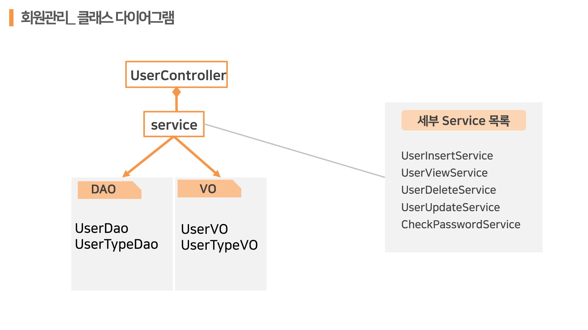

---

### ✔ 위치기반 검색 서비스
#### 📍검색 기준위치 변경
대상 : 일반회원
사용자가 검색 기준을 변경하여 해당 위치에 대한 매장 검색 가능
##### 📍카테고리별 지도보기
대상 : 일반회원
매장 카테고리별로 원하는 카테고리 선택후 매장 검색 가능

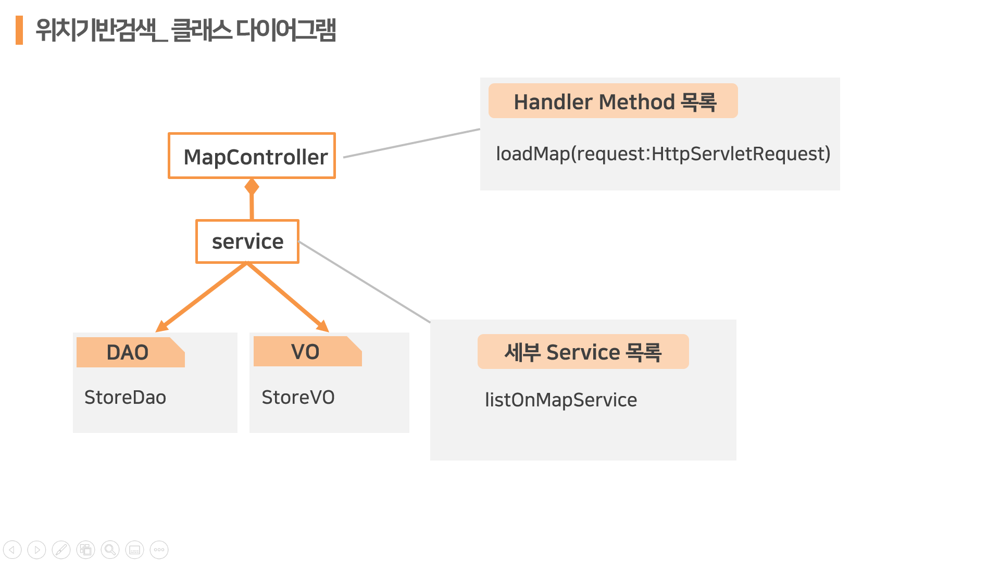

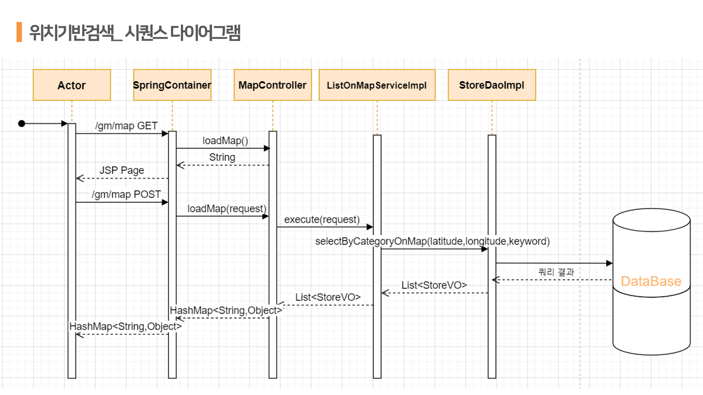

---

### ✔ 매장 서비스 (점주/일반)
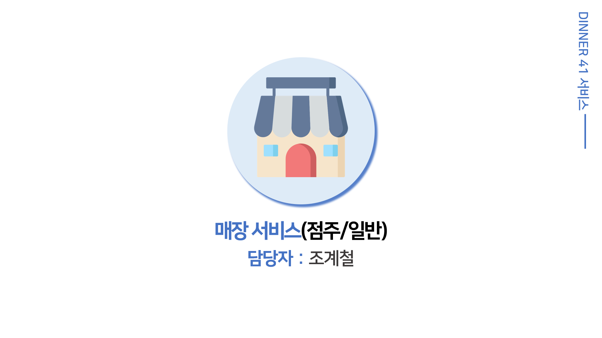

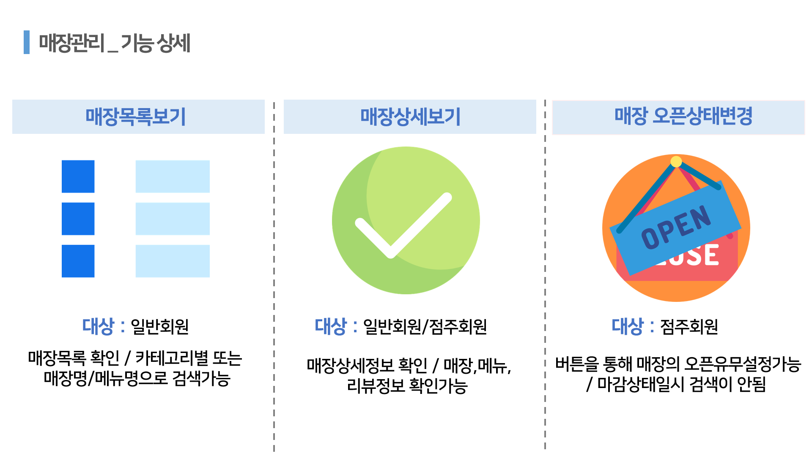
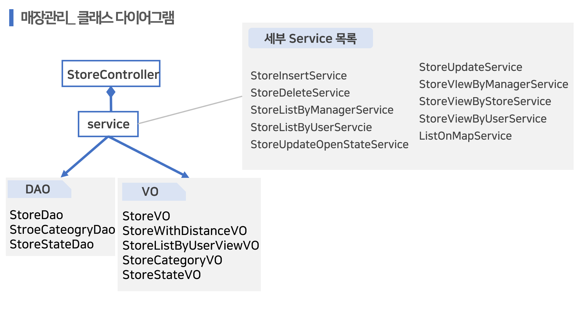
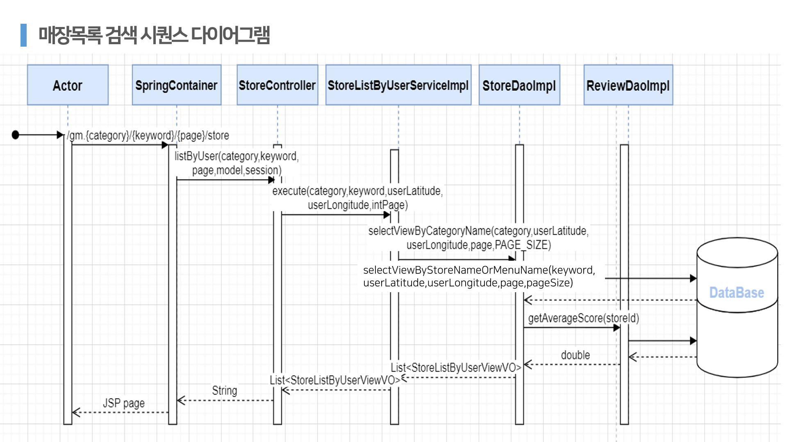

---

### ✔ 메뉴 서비스 (점주/일반)
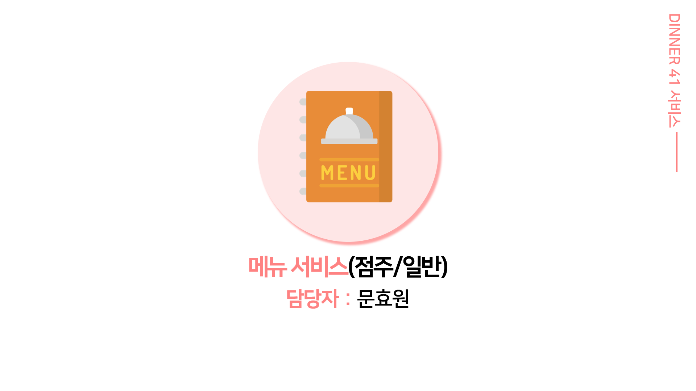
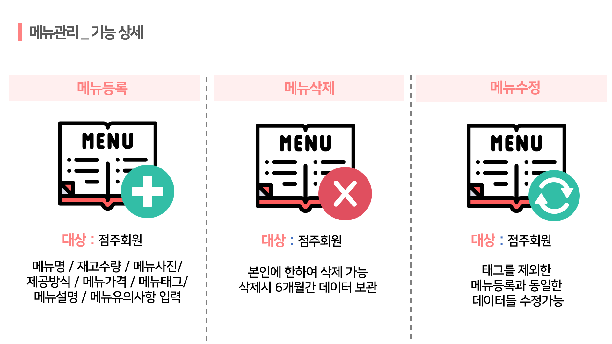
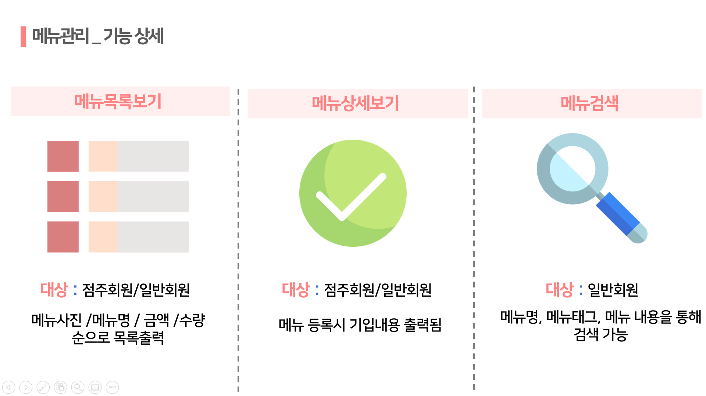

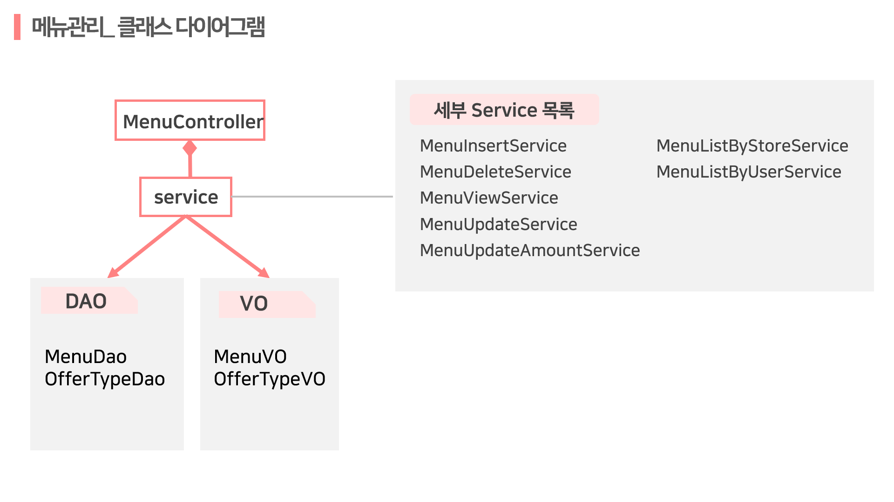
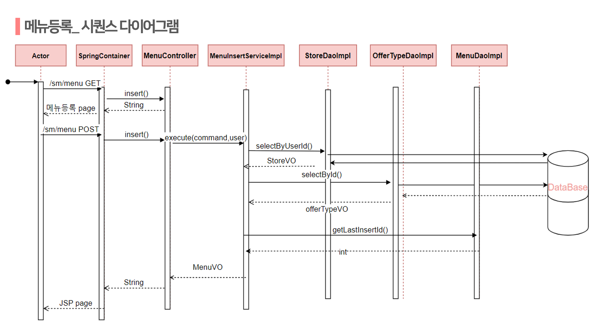

---

### ✔ 장바구니 주문 결제 서비스 (일반)

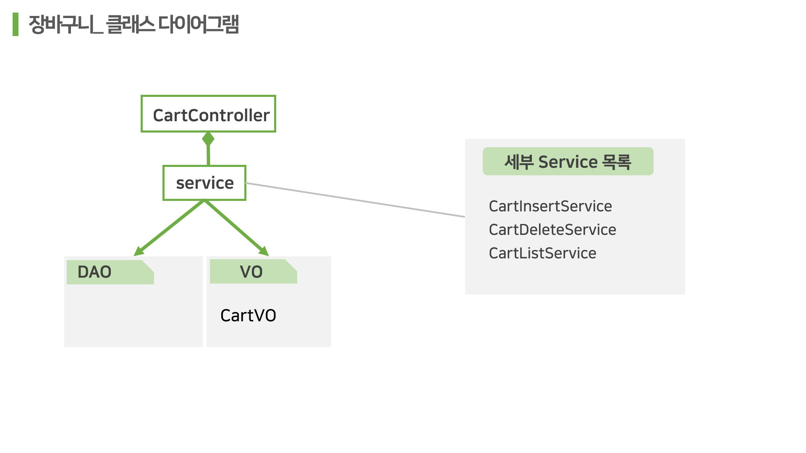

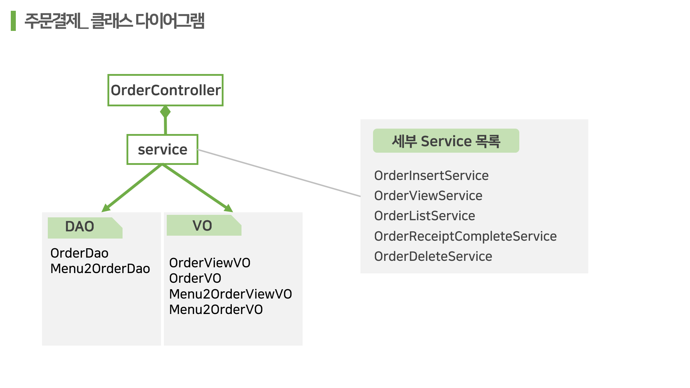

---

### ✔ 리뷰 / 문의 / 관리자 서비스 

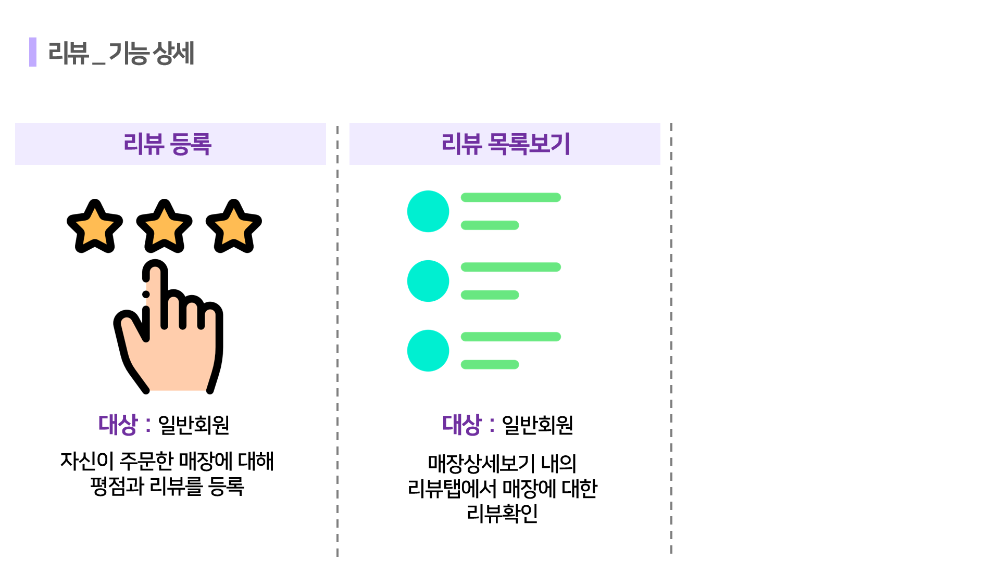

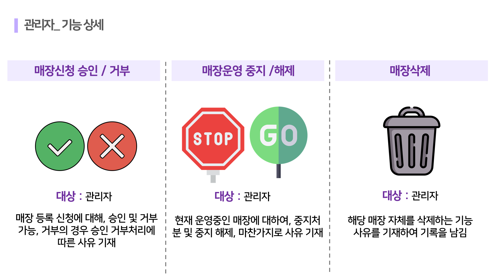
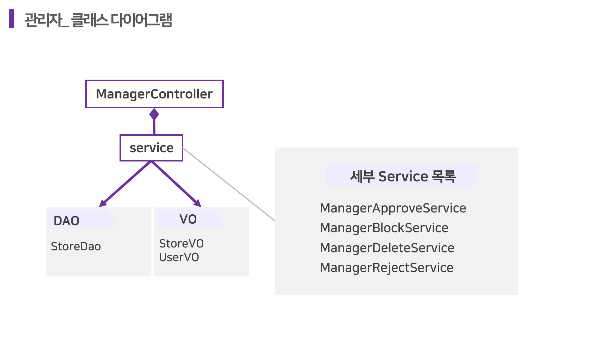

---

